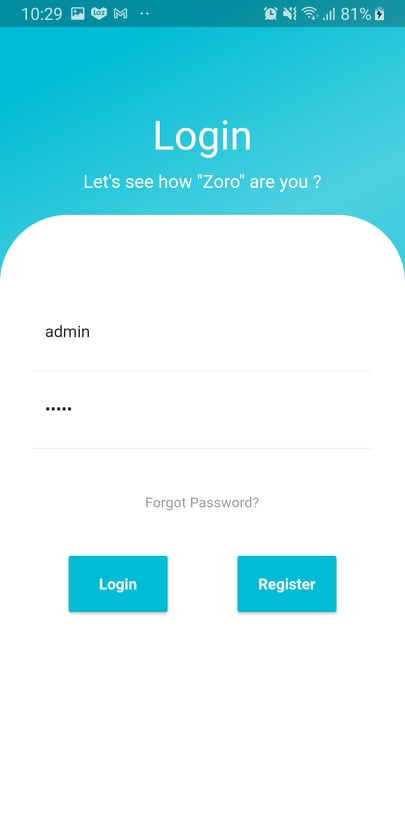
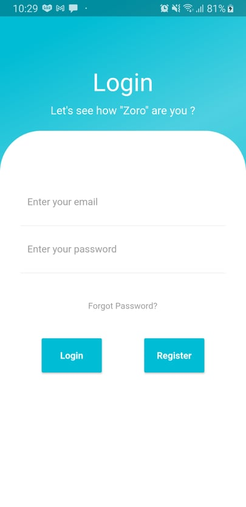
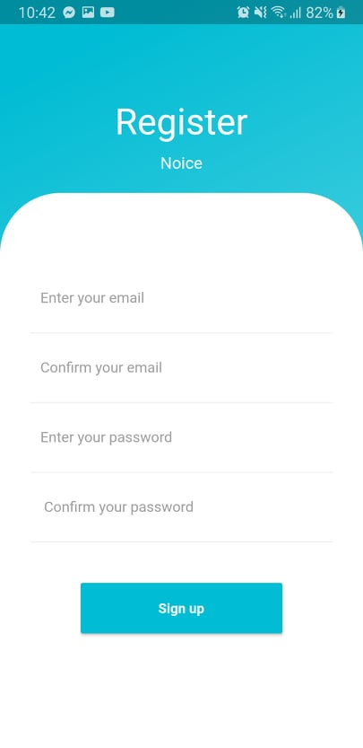
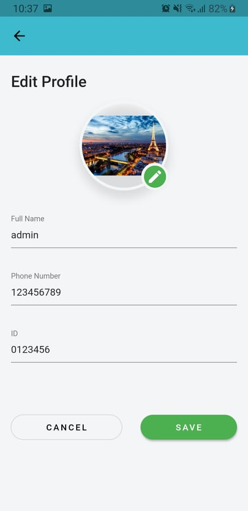
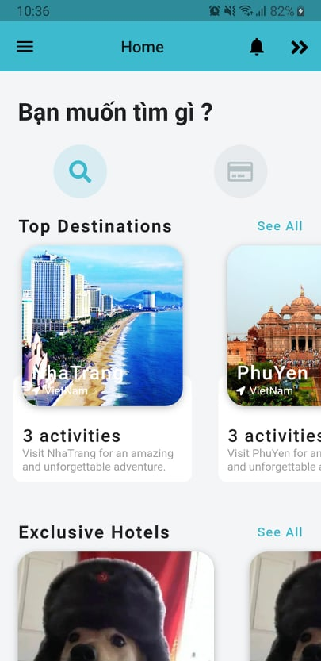
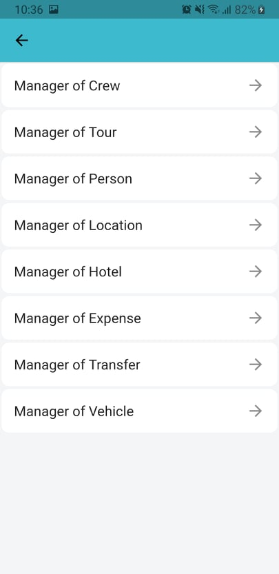

# Quản lý Tour du lịch - Tour Manager
Ứng dụng giúp đăng kí các tour du lịch qua ứng dụng mobile tiện lợi nhanh và gọn nhẹ.
Cập nhật giá vé tour một cách nhanh chóng, cập nhật danh sách đoàn trực tuyến, cập nhật ngày chuyến đi một cách sớm nhất.

## Nội dung:
1. [Chức năng](#chức-năng)
    1. [Login](#login)
    1. [Register](#register)
    1. [Xem thông tin cá nhân](#xem-thông-tin-cá-nhân)
    1. [Xem thông tin khách sạn và các tour hiện tại](#xem-thông-tin-khách-sạn-và-các-tour-hiện-tại) 
    1. [Danh sách các dịch vụ hiện có](#danh-sách-các-dịch-vụ-hiện-có)
1. [Thư viện và công nghệ](#thư-viện-và-công-nghệ)
1. [Tác giả](#tác-giả)

## Chức Năng:

### Login

   

    
   

   
### Register

   

    
   

### Xem thông tin cá nhân

   

   
    
   

### Xem thông tin khách sạn và các tour hiện tại

   

   
    
   

### Danh sách các dịch vụ hiện có

   

   
    
   

## Thư viện và Công nghệ:
- Language: Dart 
- FrameWork: Flutter SDK 1.22.6
- WebApi: ASP.Net Core
- Database: PostgreSQL

## Tác giả: 

- Đỗ Ngọc Cường - 18520542
- Nguyễn Trần Hoàng Hiếu - 18520054
